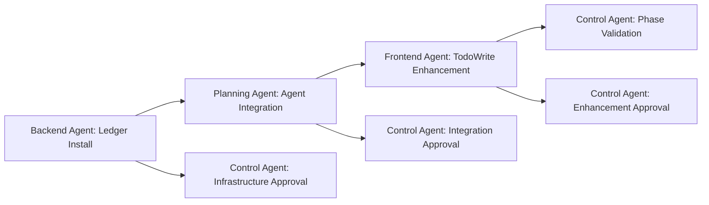

# Agent Coordination Plan - Claude Code Systems Merge

## Overview
This document defines the specific coordination protocols, communication patterns, and responsibility matrix for executing the Claude Code agent systems merge. Each agent has clearly defined roles, reporting requirements, and coordination touchpoints.

## Executive Control Structure

### Control Agent Authority
The Control Agent maintains ultimate authority throughout the merge process with these enhanced responsibilities:

**Pre-Merge Authorization**:
- Must approve merge initiation with >99% confidence
- Validates all phase plans before execution
- Ensures rollback procedures are ready

**During Merge Oversight**:
- Monitors progress every 15 minutes during active phases
- Validates quality gates at end of each phase
- Can halt merge immediately if confidence drops below 99%

**Post-Merge Validation**:
- Final system functionality approval
- Sign-off on successful integration
- Authorization for production use

## Phase-by-Phase Coordination

### Phase 1: Foundation Preservation (30 minutes)

#### Agent Coordination Matrix
| Agent | Role | Tasks | Reports To | Frequency |
|-------|------|-------|-----------|-----------|
| **Planning Agent** | Phase Coordinator | Structure analysis, enhancement planning | Control Agent | Every 10 minutes |
| **Version Control Agent** | Backup Specialist | System backup, rollback preparation | Control Agent | Task completion |
| **Documentation Agent** | CLAUDE.md Enhancement | Merge current/new protocols | Planning Agent | Task completion |
| **Control Agent** | Phase Validator | Approve each task, quality gates | N/A | Continuous |

#### Communication Protocol - Phase 1
```yaml
Start of Phase:
  Planning Agent → Control Agent: "Phase 1 initiation request with task breakdown"
  Control Agent → Planning Agent: "APPROVED/DENIED with confidence level"

During Phase:
  Version Control Agent → Control Agent: "Backup completed and verified"
  Documentation Agent → Planning Agent: "CLAUDE.md enhancement design ready"
  Planning Agent → Control Agent: "Phase 1 progress: X% complete, Y tasks remaining"

End of Phase:
  Planning Agent → Control Agent: "Phase 1 completion request with deliverables"
  Control Agent → Planning Agent: "APPROVED to proceed/DENIED with corrections needed"
```

### Phase 2: Ledger System Integration (45 minutes)

#### Agent Coordination Matrix
| Agent | Role | Tasks | Reports To | Frequency |
|-------|------|-------|-----------|-----------|
| **Backend Agent** | Infrastructure Lead | Ledger installation, JSON setup | Control Agent | Every 15 minutes |
| **Planning Agent** | Integration Coordinator | Agent-ledger mapping | Control Agent | Every 15 minutes |
| **Frontend Agent** | TodoWrite Enhancement | Tool integration with ledgers | Backend Agent | Task completion |
| **Control Agent** | Quality Validator | Validate integrations, approve next steps | N/A | Continuous |

#### Coordination Dependencies - Phase 2


#### Communication Protocol - Phase 2
```yaml
Start of Phase:
  Backend Agent → Control Agent: "Ledger infrastructure installation request"
  Control Agent → Backend Agent: "APPROVED with validation requirements"

Mid-Phase Coordination:
  Backend Agent → Planning Agent: "Ledger infrastructure ready for integration"
  Planning Agent → Backend Agent: "Integration requirements understood"
  Planning Agent → Frontend Agent: "Ready for TodoWrite enhancement"

Progress Updates:
  Backend Agent → Control Agent: "Ledger installation progress: directories created, templates installed"
  Planning Agent → Control Agent: "Agent integration progress: X/9 agents connected"
  Frontend Agent → Control Agent: "TodoWrite enhancement progress: sync implemented"

End of Phase:
  Planning Agent → Control Agent: "All agents connected to ledger system successfully"
  Control Agent → Planning Agent: "Phase 2 APPROVED, proceed to Phase 3"
```

### Phase 3: Advanced Features Integration (60 minutes)

#### Agent Coordination Matrix
| Agent | Role | Tasks | Reports To | Frequency |
|-------|------|-------|-----------|-----------|
| **Control Agent** | Feature Integration Lead | Quality gates, confidence tracking | N/A | Continuous |
| **Research Agent** | Improvement Agent Support | Technical documentation, installation | Control Agent | Every 20 minutes |
| **Version Control Agent** | Conflict Prevention | File ownership, branch isolation | Control Agent | Task completion |
| **Backend Agent** | System Enhancement | Dependency validation support | Control Agent | Task completion |

#### Advanced Feature Integration Sequence
```yaml
Sequence 1 (25 minutes):
  Research Agent + Control Agent: Install Improvement Agent
  - Dual-layer configuration (Sonnet/Opus)
  - Global observation ledger setup
  - Continuous monitoring activation

Sequence 2 (20 minutes):
  Control Agent: Quality Gates Enhancement
  - >99% confidence requirement implementation
  - Escalation trigger configuration
  - Validation procedure upgrade

Sequence 3 (15 minutes):
  Version Control Agent + Backend Agent: Conflict Prevention
  - File ownership tracking
  - Dependency validation
  - Integration window scheduling
```

#### Communication Protocol - Phase 3
```yaml
Improvement Agent Installation:
  Research Agent → Control Agent: "Improvement agent configuration ready"
  Control Agent → Research Agent: "Installation APPROVED, proceed with confidence tracking"
  Research Agent → Control Agent: "Dual-layer system operational, observation active"

Quality Gates Enhancement:
  Control Agent → Control Agent: "Self-assessment: confidence tracking implemented"
  Control Agent → Planning Agent: "Quality gates upgraded, >99% requirement active"

Conflict Prevention:
  Version Control Agent → Control Agent: "File ownership system implemented"
  Backend Agent → Control Agent: "Dependency validation operational"
  Control Agent → All Agents: "Conflict prevention system active"
```

### Phase 4: Testing and Validation (30 minutes)

#### Agent Coordination Matrix
| Agent | Role | Tasks | Reports To | Frequency |
|-------|------|-------|-----------|-----------|
| **Testing Agent** | Lead Validator | Functionality tests, system health | Control Agent | Every 10 minutes |
| **Control Agent** | Coordination Tester | Multi-agent workflow validation | N/A | Continuous |
| **All Agents** | Test Participants | Respond to coordination test scenario | Testing Agent | As needed |

#### Testing Coordination Protocol
```yaml
Test Scenario Execution:
  Testing Agent → Control Agent: "Initiating functionality tests"
  Testing Agent → All Agents: "Agent activation test - please respond"
  All Agents → Testing Agent: "Agent [name] responding, status operational"
  Testing Agent → Control Agent: "9/9 agents responding correctly"

Multi-Agent Workflow Test:
  Control Agent → Planning Agent: "Execute test scenario: Add user profile edit"
  Planning Agent → All Agents: "Test workflow initiated, following task distribution"
  [Workflow execution with each agent reporting completion]
  Testing Agent → Control Agent: "Multi-agent coordination test SUCCESSFUL"

Final Validation:
  Testing Agent → Control Agent: "All tests passed, system ready"
  Control Agent → Control Agent: "Final confidence check: >99% achieved"
  Control Agent → Planning Agent: "Merge APPROVED, system operational"
```

## Inter-Agent Communication Standards

### Message Format Requirements
All agents must use this standardized format for merge communications:

```yaml
Standard Message Template:
  agent_id: "[sending-agent-name]"
  target_agent: "[receiving-agent-name]"
  message_type: "[status_update/request/approval/notification]"
  phase: "[current-phase-number]"
  task: "[specific-task-reference]"
  content: "[detailed-message-content]"
  confidence_level: "[percentage-if-applicable]"
  timestamp: "[ISO-format-timestamp]"
  requires_response: "[true/false]"
```

### Escalation Procedures

#### Level 1: Task-Level Issues
**Trigger**: Individual task problems, delays, or minor conflicts
**Protocol**:
1. Agent reports issue to immediate supervisor (per coordination matrix)
2. Supervisor attempts resolution within 5 minutes
3. If unresolved, escalate to Level 2

#### Level 2: Phase-Level Issues
**Trigger**: Multiple task issues, phase delays, or coordination conflicts
**Protocol**:
1. Phase coordinator reports to Control Agent
2. Control Agent assesses impact and confidence level
3. If confidence <99%, escalate to Level 3

#### Level 3: Merge-Critical Issues
**Trigger**: System-wide problems, confidence <95%, or critical failures
**Protocol**:
1. Control Agent initiates immediate pause
2. All agents halt current activities
3. Emergency assessment and rollback consideration
4. Requires explicit approval to continue

### Quality Gate Checkpoints

#### Phase Completion Gates
Each phase requires explicit Control Agent approval based on:

```yaml
Phase 1 Gate:
  criteria:
    - Complete system backup verified
    - Directory structure unified
    - CLAUDE.md enhancement planned
    - Zero breaking changes
  confidence_requirement: ">99%"
  
Phase 2 Gate:
  criteria:
    - Ledger infrastructure operational
    - All 9 agents connected successfully
    - TodoWrite integration functional
    - Task tracking validated
  confidence_requirement: ">99%"

Phase 3 Gate:
  criteria:
    - Improvement agent operational
    - Quality gates enhanced
    - Conflict prevention active
    - Advanced features integrated
  confidence_requirement: ">99%"

Phase 4 Gate:
  criteria:
    - All functionality tests pass
    - Multi-agent coordination verified
    - Performance benchmarks met
    - System ready for production
  confidence_requirement: ">99%"
```

## Agent Specialization During Merge

### Planning Agent - Merge Orchestrator
**Unique Responsibilities**:
- Overall merge timeline management
- Task dependency coordination
- Progress aggregation and reporting
- Phase transition management

**Reporting Requirements**:
- Status updates every 15 minutes during active phases
- Immediate escalation for any coordination issues
- Phase completion reports with full deliverable documentation

### Control Agent - Quality Guardian
**Unique Responsibilities**:
- >99% confidence validation at all checkpoints
- Emergency halt authorization
- Final system approval
- Quality gate enforcement

**Decision Making Authority**:
- Approve/deny each phase progression
- Halt merge for quality concerns
- Authorize rollback procedures
- Final production readiness sign-off

### Version Control Agent - Safety Coordinator
**Unique Responsibilities**:
- Comprehensive backup management
- Rollback procedure execution
- Git coordination throughout merge
- Safety checkpoint maintenance

**Critical Functions**:
- Backup integrity verification
- Rollback capability testing
- Emergency recovery procedures
- Version tracking of merge process

### Backend Agent - Technical Infrastructure
**Unique Responsibilities**:
- Ledger system technical implementation
- JSON template installation
- System integration validation
- Performance monitoring

**Integration Focus**:
- Ledger directory structure creation
- Agent-to-ledger connectivity
- System performance validation
- Technical troubleshooting

### Research Agent - Knowledge Support
**Unique Responsibilities**:
- Technical documentation for new features
- Improvement agent installation support
- Compatibility analysis
- Integration guidance

**Knowledge Areas**:
- New system architecture understanding
- Feature compatibility analysis
- Technical integration requirements
- Advanced feature capabilities

## Success Coordination Metrics

### Real-Time Tracking
During the merge, these metrics will be continuously monitored:

```yaml
Communication Metrics:
  - Agent response time: <30 seconds
  - Message acknowledgment rate: 100%
  - Escalation resolution time: <5 minutes
  - Coordination success rate: >95%

Technical Metrics:
  - Phase completion accuracy: 100%
  - Quality gate pass rate: 100%
  - Rollback readiness: Continuously verified
  - System stability: Zero crashes

Collaboration Metrics:
  - Inter-agent coordination: >95% efficiency
  - Task handoff success: 100%
  - Dependency resolution: <2 minutes average
  - Multi-agent workflow: Seamless execution
```

### Final Coordination Validation

#### System Integration Test
**Multi-Agent Scenario**: "Implement a new user dashboard feature"
**Expected Coordination Flow**:
1. **Planning Agent**: Creates comprehensive task breakdown
2. **Control Agent**: Validates approach with >99% confidence
3. **Research Agent**: Provides technical requirements
4. **UX Agent**: Designs user interface specifications
5. **UI Agent**: Implements React components with tests
6. **Backend Agent**: Creates state management and APIs
7. **Testing Agent**: Validates complete functionality
8. **Documentation Agent**: Updates all documentation
9. **Version Control Agent**: Manages commits and releases
10. **Improvement Agent**: Observes and records for learning

**Success Criteria**:
- All agents participate seamlessly
- Ledger system tracks every activity
- Quality gates maintain >99% confidence
- No coordination conflicts occur
- Final feature fully functional

## Post-Merge Coordination

### Immediate Coordination (First 24 hours)
- **Control Agent**: Monitor system stability and performance
- **Testing Agent**: Continuous integration validation
- **Documentation Agent**: Update all coordination protocols
- **Improvement Agent**: Begin learning pattern collection

### Ongoing Coordination (First Week)
- **Planning Agent**: Optimize workflow based on merged system
- **All Agents**: Report any coordination issues immediately
- **Version Control Agent**: Monitor and maintain system integrity
- **Research Agent**: Document lessons learned and improvements

This coordination plan ensures seamless agent collaboration throughout the merge process while maintaining the highest quality standards and providing clear communication pathways for all participants.