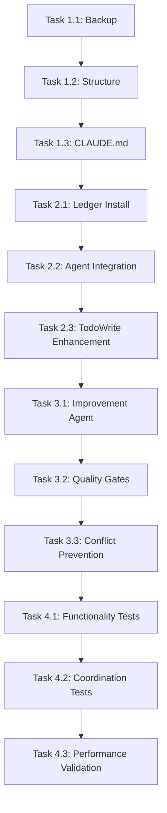

# Claude Code Agent Systems Merge - Task Breakdown Structure

## Overview
This document provides the detailed task breakdown for merging the current Claude Code agent system with the advanced new system. Each task includes specific deliverables, dependencies, and success criteria.

## Phase 1: Foundation Preservation (30 minutes total)

### Task 1.1: System Backup and Verification (5 minutes)
**Agent**: Version Control Agent
**Dependencies**: None
**Priority**: Critical

**Subtasks**:
- Create timestamped backup of ~/.claude directory
- Verify backup integrity and completeness
- Document current system state and configuration
- Prepare rollback procedure documentation

**Deliverables**:
- Complete backup in ~/.claude_backup_[timestamp]
- Integrity verification report
- Current system documentation snapshot

**Success Criteria**:
- 100% of current system files backed up
- Backup verified as restorable
- Rollback procedure tested and documented

**Commands**:
```bash
cp -r ~/.claude ~/.claude_backup_$(date +%Y%m%d_%H%M%S)
ls -la ~/.claude_backup_*
diff -r ~/.claude ~/.claude_backup_* | head -10
```

### Task 1.2: Directory Structure Analysis and Planning (10 minutes)
**Agent**: Planning Agent
**Dependencies**: Task 1.1 completed
**Priority**: High

**Subtasks**:
- Map current directory structure
- Analyze new system structure requirements
- Design unified directory layout
- Identify potential conflicts

**Deliverables**:
- Current structure documentation
- Target structure specification
- Migration mapping document
- Conflict resolution plan

**Success Criteria**:
- Complete understanding of both systems
- Clear migration path defined
- Zero conflicts in planned structure

### Task 1.3: CLAUDE.md Enhancement Planning (15 minutes)
**Agent**: Documentation Agent
**Dependencies**: Tasks 1.1, 1.2 completed
**Priority**: High

**Subtasks**:
- Analyze current CLAUDE.md comprehensive workflow
- Identify integration points for new system features
- Plan enhancements while preserving existing functionality
- Design merged protocol documentation

**Deliverables**:
- Enhanced CLAUDE.md specification
- Integration point mapping
- Backward compatibility verification
- New feature integration plan

**Success Criteria**:
- All current functionality preserved
- New features clearly integrated
- No breaking changes to existing workflows
- Documentation remains comprehensive and actionable

## Phase 2: Ledger System Integration (45 minutes total)

### Task 2.1: Ledger Infrastructure Installation (15 minutes)
**Agent**: Backend Agent
**Dependencies**: Phase 1 completed
**Priority**: High

**Subtasks**:
- Create ledger directory structure
- Install JSON task tracking templates
- Set up observation infrastructure
- Configure global observation system

**Deliverables**:
- Complete ledger directory structure
- All JSON templates installed
- Observation system operational
- Global ledger initialized

**Success Criteria**:
- All directories created successfully
- JSON templates valid and functional
- Observation system capturing data
- Global ledger accessible and writable

**Commands**:
```bash
mkdir -p ~/.claude/ledgers
mkdir -p ~/.claude/observation
mkdir -p ~/.claude/global-observation
cp /Volumes/.../ledgers/*.json ~/.claude/ledgers/
cp /Volumes/.../task-registry.json ~/.claude/
```

### Task 2.2: Agent-Ledger Integration (20 minutes)
**Agent**: Control Agent + Planning Agent
**Dependencies**: Task 2.1 completed
**Priority**: Critical

**Subtasks**:
- Update each existing agent definition
- Add ledger reference configurations
- Implement task status reporting
- Connect agents to centralized registry

**Deliverables**:
- Updated agent definitions (9 files)
- Ledger integration code
- Task status reporting protocols
- Registry connection validation

**Success Criteria**:
- All 9 agents connected to ledger system
- Task status updates functioning
- Registry coordination operational
- Backward compatibility maintained

**Agent-Specific Updates**:
```yaml
control-agent.md: Add ledger coordination protocols
backend-agent.md: Include task tracking integration
frontend-agent.md: Add status reporting requirements
planning-agent.md: Connect to task registry
research-agent.md: Include observation recording
documentation-agent.md: Add ledger update protocols
testing-agent.md: Include validation reporting
version-control-agent.md: Add commit coordination
general-purpose.md: Include ledger awareness
```

### Task 2.3: TodoWrite Tool Enhancement (10 minutes)
**Agent**: Frontend Agent
**Dependencies**: Task 2.2 completed
**Priority**: Medium

**Subtasks**:
- Analyze current TodoWrite integration patterns
- Design ledger synchronization capabilities
- Implement dependency tracking features
- Test enhanced functionality

**Deliverables**:
- Enhanced TodoWrite integration
- Ledger synchronization code
- Dependency tracking implementation
- Integration test results

**Success Criteria**:
- Current TodoWrite patterns preserved
- Ledger sync functioning correctly
- Dependencies tracked accurately
- No performance degradation

## Phase 3: Advanced Features Integration (60 minutes total)

### Task 3.1: Improvement Agent Installation (25 minutes)
**Agent**: Control Agent + Research Agent
**Dependencies**: Phase 2 completed
**Priority**: High

**Subtasks**:
- Install dual-layer improvement agent definition
- Configure Sonnet project layer for continuous observation
- Set up Opus meta layer for deep analysis
- Initialize global observation ledger

**Deliverables**:
- improvement-agent.md installed and configured
- Project layer observation active
- Meta layer analysis framework ready
- Global ledger operational

**Success Criteria**:
- Improvement agent responds to activation
- Continuous observation functioning
- Meta analysis framework accessible
- Global ledger recording activities

**Configuration**:
```yaml
name: "improvement-agent"
project_layer:
  model: "claude-3-5-sonnet"
  mode: "continuous_observation"
  activation: "immediate"
meta_layer:
  model: "claude-3-5-opus"
  mode: "deep_analysis"
  activation: "control_agent_triggered"
```

### Task 3.2: Quality Gates Enhancement (20 minutes)
**Agent**: Control Agent
**Dependencies**: Task 3.1 completed
**Priority**: Critical

**Subtasks**:
- Upgrade control agent with >99% confidence requirements
- Implement automatic escalation triggers
- Add confidence level tracking
- Enhance validation procedures

**Deliverables**:
- Enhanced control-agent.md
- Confidence tracking system
- Escalation procedures
- Validation enhancement

**Success Criteria**:
- >99% confidence requirement enforced
- Automatic escalation functioning
- Confidence levels tracked accurately
- Enhanced validation operational

**Quality Gate Updates**:
```yaml
minimum_confidence: 99
escalation_triggers:
  - confidence_drop_below_99
  - timeline_risk_detected
  - technical_blockers_identified
  - resource_conflicts_found
```

### Task 3.3: Conflict Prevention System (15 minutes)
**Agent**: Version Control Agent + Backend Agent
**Dependencies**: Task 3.2 completed
**Priority**: Medium

**Subtasks**:
- Implement file ownership tracking
- Add dependency validation
- Set up branch isolation enforcement
- Configure integration windows

**Deliverables**:
- File ownership system
- Dependency validation code
- Branch isolation protocols
- Integration scheduling

**Success Criteria**:
- File ownership prevents conflicts
- Dependencies validated before execution
- Branch isolation working
- Integration windows scheduled correctly

## Phase 4: Testing and Validation (30 minutes total)

### Task 4.1: Agent Functionality Testing (10 minutes)
**Agent**: Testing Agent
**Dependencies**: Phase 3 completed
**Priority**: Critical

**Subtasks**:
- Test all agent activation patterns
- Verify ledger connectivity for each agent
- Validate observation system operation
- Check quality gate functionality

**Deliverables**:
- Agent activation test results
- Ledger connectivity validation
- Observation system verification
- Quality gate test report

**Success Criteria**:
- All 10 agents (9 existing + 1 new) activate correctly
- Ledger system records all activities
- Observation system captures data
- Quality gates enforce requirements

**Test Commands**:
```bash
# Test agent directory
ls -la ~/.claude/agents/

# Verify ledger system
cat ~/.claude/task-registry.json

# Check observation
ls -la ~/.claude/observation/

# Test improvement agent
grep -n "improvement-agent" ~/.claude/agents/improvement-agent.md
```

### Task 4.2: Multi-Agent Coordination Testing (15 minutes)
**Agent**: Control Agent + All Agents
**Dependencies**: Task 4.1 completed
**Priority**: Critical

**Subtasks**:
- Execute test scenario: "Add a simple feature"
- Validate multi-agent workflow
- Test ledger coordination
- Verify quality gates

**Test Scenario**:
```yaml
scenario: "Add user profile edit functionality"
expected_flow:
  1. Planning Agent: Create task breakdown
  2. Control Agent: Validate approach (>99% confidence)
  3. UX Agent: Design user interface wireframes
  4. UI Agent: Implement React components
  5. Backend Agent: Create state management
  6. Testing Agent: Validate functionality
  7. Documentation Agent: Update specifications
  8. Version Control Agent: Manage commits
  9. Improvement Agent: Observe and record
```

**Deliverables**:
- Complete workflow execution log
- Multi-agent coordination verification
- Ledger state after test scenario
- Quality gate validation results

**Success Criteria**:
- All agents participate correctly
- Ledger tracks all activities
- Quality gates function properly
- No coordination conflicts

### Task 4.3: System Health and Performance Validation (5 minutes)
**Agent**: Control Agent
**Dependencies**: Task 4.2 completed
**Priority**: High

**Subtasks**:
- Validate system response times
- Check memory and resource usage
- Verify rollback capability
- Confirm emergency procedures

**Deliverables**:
- Performance metrics report
- Resource usage analysis
- Rollback test results
- Emergency procedure validation

**Success Criteria**:
- Agent response time <5 seconds
- Memory usage within acceptable limits
- Rollback procedure functional
- Emergency protocols accessible

**Performance Tests**:
```bash
# Response time test
time claude-code --activate-agent planning-agent

# Memory usage check
ps aux | grep claude | head -5

# Rollback test preparation
ls -la ~/.claude_backup_*
```

## Agent Coordination Matrix

### Task Dependencies


### Agent Workload Distribution
| Agent | Phase 1 | Phase 2 | Phase 3 | Phase 4 | Total |
|-------|---------|---------|---------|---------|-------|
| Planning Agent | 25 min | 20 min | 0 min | 5 min | 50 min |
| Control Agent | 0 min | 20 min | 45 min | 20 min | 85 min |
| Version Control Agent | 5 min | 0 min | 15 min | 5 min | 25 min |
| Documentation Agent | 15 min | 0 min | 0 min | 0 min | 15 min |
| Backend Agent | 0 min | 15 min | 15 min | 0 min | 30 min |
| Frontend Agent | 0 min | 10 min | 0 min | 0 min | 10 min |
| Research Agent | 0 min | 0 min | 25 min | 0 min | 25 min |
| Testing Agent | 0 min | 0 min | 0 min | 10 min | 10 min |

## Risk Mitigation Tasks

### High-Priority Risk Tasks
1. **Backup Verification** (Task 1.1) - Ensures rollback capability
2. **Agent Integration** (Task 2.2) - Critical for system functionality
3. **Quality Gates** (Task 3.2) - Maintains system reliability
4. **Coordination Testing** (Task 4.2) - Validates multi-agent workflows

### Rollback Procedures
Each phase includes rollback checkpoints:
- **Phase 1 Rollback**: Restore from backup, no system changes
- **Phase 2 Rollback**: Remove ledger directories, restore agent files
- **Phase 3 Rollback**: Remove improvement agent, restore quality gates
- **Phase 4 Rollback**: Complete system restoration from backup

## Success Metrics by Phase

### Phase 1 Success Criteria
- [x] Complete system backup created and verified
- [x] Directory structure unified and planned
- [x] CLAUDE.md enhancement designed
- [x] Zero existing functionality broken

### Phase 2 Success Criteria
- [ ] Ledger infrastructure operational
- [ ] All agents connected to ledger system
- [ ] TodoWrite integration enhanced
- [ ] Task tracking functioning

### Phase 3 Success Criteria
- [ ] Improvement agent installed and active
- [ ] Quality gates upgraded to >99% confidence
- [ ] Conflict prevention system operational
- [ ] Advanced features integrated

### Phase 4 Success Criteria
- [ ] All agents respond correctly
- [ ] Multi-agent coordination verified
- [ ] Performance benchmarks met
- [ ] System ready for production use

## Completion Timeline

**Total Estimated Time**: 2 hours 45 minutes
**Critical Path**: Tasks 1.1 → 1.2 → 1.3 → 2.1 → 2.2 → 3.1 → 3.2 → 4.1 → 4.2 → 4.3
**Parallel Opportunities**: Documentation can run parallel with technical implementation
**Buffer Time**: 15 minutes included for unexpected issues

This comprehensive task breakdown ensures systematic, low-risk integration of both systems while maintaining full functionality and adding advanced capabilities.