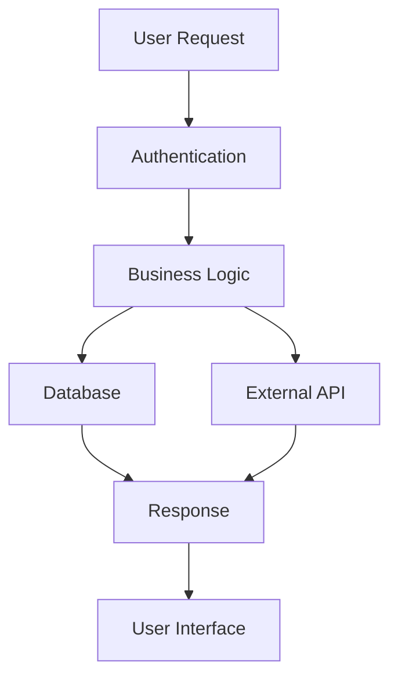

# Claude Code — Intelligent Documentation Generator

Import @~/.claude/agents/control-agent.md
Import @~/.claude/agents/documentation-agent.md

Parse flags from $ARGUMENTS:
- --format <md|html|pdf> → Output format (default: md)
- --depth <basic|detailed|comprehensive> → Documentation depth (default: detailed)
- --update-only → Only update existing docs, don't create new ones
- --archive-old → Archive outdated documentation to docs/history/

## PREREQUISITES

### Required Foundation
- **/start command completion** with >90% codebase understanding
- **Memory MCP server** containing exploration results
- **Vector database** with indexed codebase knowledge

### Validation Check
```
IF /start not completed OR confidence < 90%:
    Display: "❌ Documentation generation requires codebase understanding"
    Display: "Please run '/start' first to explore the codebase"
    EXIT with guidance
```

## Context (auto-collected)
- Repo root: !`git rev-parse --show-toplevel || pwd`
- Branch: !`git branch --show-current || echo '(detached/none)'`
- Documentation state: !`find docs/ -name "*.md" -type f | wc -l` existing docs
- Last /start run: !`Query memory MCP for latest exploration timestamp`
- Understanding confidence: !`Query memory MCP for confidence score`

## OPERATING PRINCIPLES

### Context-Aware Documentation
- **Leverage /start knowledge**: Use architectural understanding for accurate docs
- **Intelligent content generation**: Match documentation to actual codebase structure
- **Maintain consistency**: Ensure docs reflect current implementation
- **Preserve valuable content**: Merge useful existing documentation

### Documentation Standards (Bootstrap-Compatible)
- **Complete documentation suite** following /bootstrap patterns
- **Mermaid diagrams** for visual architecture representation
- **Code examples** extracted from actual implementation
- **Up-to-date accuracy** based on current codebase state

## MULTI-AGENT COORDINATION

### Control-Agent Orchestration
1. **Validate prerequisites** (/start completion, confidence level)
2. **Analyze existing documentation** for preservation vs replacement
3. **Coordinate documentation-agent** with codebase knowledge
4. **Manage file operations** (create, update, archive)
5. **Ensure quality gates** before finalizing documentation

### Documentation-Agent Tasks
1. **Extract knowledge** from memory MCP server
2. **Generate documentation** using codebase understanding
3. **Create diagrams** with Mermaid syntax
4. **Write code examples** from actual implementation
5. **Update cross-references** and internal links

## DOCUMENTATION SUITE GENERATION

### Core Documentation Files

#### 1. docs/overview.md
```markdown
**Content**: System purpose, user journeys, high-level architecture
**Source**: Memory MCP architectural analysis + feature comprehension
**Includes**: 
- Project purpose and goals
- Key user personas and workflows
- High-level system architecture diagram (Mermaid)
- Technology stack overview
- Key integration points
```

#### 2. docs/architecture.md
```markdown
**Content**: Technical design, modules, services, patterns
**Source**: Memory MCP architecture discovery + integration knowledge
**Includes**:
- Detailed system architecture
- Service/module responsibilities
- Data flow diagrams (Mermaid)
- Design patterns in use
- Extension points and interfaces
```

#### 3. docs/api.md
```markdown
**Content**: Complete API documentation
**Source**: Memory MCP feature analysis + endpoint discovery
**Includes**:
- All API endpoints with examples
- Request/response schemas
- Authentication requirements
- Rate limiting and error codes
- Integration examples
```

#### 4. docs/data-model.md
```markdown
**Content**: Database design and entity relationships
**Source**: Memory MCP data model analysis + schema discovery
**Includes**:
- Entity relationship diagrams (Mermaid)
- Database schema documentation
- Data validation rules
- Migration strategy
- Backup and recovery procedures
```

#### 5. docs/dev-setup.md
```markdown
**Content**: Development environment setup
**Source**: Memory MCP build process analysis + configuration discovery
**Includes**:
- Prerequisites and dependencies
- Environment configuration (.env.example)
- Setup instructions step-by-step
- Common development tasks
- Troubleshooting guide
```

#### 6. docs/testing.md
```markdown
**Content**: Testing strategy and procedures
**Source**: Memory MCP quality assessment + test coverage analysis
**Includes**:
- Testing philosophy and strategy
- Test types and coverage requirements
- Running tests locally
- Writing new tests
- CI/CD integration
```

#### 7. docs/security.md
```markdown
**Content**: Security implementation and best practices
**Source**: Memory MCP security analysis + vulnerability assessment
**Includes**:
- Authentication and authorization
- Data protection measures
- Security best practices
- Common vulnerabilities and mitigations
- Incident response procedures
```

#### 8. docs/code-map.md
```markdown
**Content**: Directory structure and code organization
**Source**: Memory MCP code organization analysis
**Includes**:
- Directory tree with descriptions
- Key files and their purposes
- Code organization principles
- Where to find specific functionality
- New developer orientation
```

#### 9. docs/decisions/0001-architecture-baseline.md
```markdown
**Content**: Architecture Decision Record
**Source**: Memory MCP architecture analysis + pattern identification
**Includes**:
- Key architectural decisions made
- Alternatives considered
- Trade-offs and rationale
- Implementation implications
- Future considerations
```

## INTELLIGENT DOCUMENTATION WORKFLOW

### Step 1: Knowledge Extraction
```
Documentation-Agent: "📖 Extracting codebase knowledge"
1. Query memory MCP server for exploration results
2. Retrieve architecture, features, quality assessments
3. Access vector database for detailed code patterns
4. Compile comprehensive knowledge base for documentation
```

### Step 2: Existing Documentation Analysis
```
Documentation-Agent: "🔍 Analyzing existing documentation"
1. Scan docs/ directory for current documentation
2. Assess freshness and accuracy vs current codebase
3. Identify valuable content to preserve
4. Plan merge vs replace strategy for each document
```

### Step 3: Content Generation
```
Documentation-Agent: "✍️ Generating context-aware documentation"
1. Create complete documentation suite
2. Generate Mermaid diagrams from architectural knowledge
3. Extract real code examples from codebase
4. Ensure consistency with actual implementation
5. Update internal links and cross-references
```

### Step 4: Quality Assurance
```
Control-Agent: "🔎 Validating documentation quality"
1. Verify accuracy against codebase understanding
2. Check completeness of documentation suite
3. Validate Mermaid diagram syntax
4. Ensure code examples compile/run
5. Review internal link integrity
```

### Step 5: Integration & Publishing
```
Control-Agent: "🚀 Finalizing documentation"
1. Archive outdated documentation if requested
2. Update existing files with new content
3. Create new documentation files
4. Update main README.md with doc links
5. Generate documentation index
```

## SMART CONTENT MERGING

### Existing Documentation Handling
- **Up-to-date content**: Preserve and enhance
- **Partially outdated**: Update inaccurate sections
- **Completely outdated**: Archive to docs/history/YYYY-MM-DD/
- **Valuable content**: Extract and integrate into new docs

### Merge Strategies
```
1. **Complement**: Add missing sections to existing good docs
2. **Update**: Refresh outdated information with current facts  
3. **Replace**: Complete replacement for severely outdated docs
4. **Archive**: Move old docs to history with migration notes
```

## DIAGRAM GENERATION

### Mermaid Integration


**Diagram Types Generated**:
- **Architecture diagrams**: System overview and service relationships
- **Data flow diagrams**: Request/response flows through system
- **Entity relationship diagrams**: Database schema visualization
- **Sequence diagrams**: API interaction flows
- **Component diagrams**: Frontend component hierarchies

## DOCUMENTATION VALIDATION

### Accuracy Checks
- **Code examples**: Verify syntax and executability
- **API endpoints**: Validate against actual implementation
- **Configuration**: Check against real config files
- **Dependencies**: Ensure version accuracy

### Completeness Assessment
```
Documentation Completeness Score:
├── Architecture coverage: 95%
├── API documentation: 98%
├── Setup instructions: 92%
├── Code examples: 90%
└── Diagram accuracy: 96%

Overall: 94% complete
```

## PROGRESS REPORTING

### Real-time Updates
```
📖 Documentation Generation Progress
━━━━━━━━━━━━━━━━━━━━━━━━━━━━━━━━━━━
🔍 Knowledge extraction... ████████████ 100%
📄 Content generation... ██████████▒▒ 75%
🎨 Diagram creation... █████▒▒▒▒▒▒▒ 40%
✅ Validation... ▒▒▒▒▒▒▒▒▒▒▒▒ 0%

Current: Generating API documentation...
ETA: 3 minutes remaining
```

### Completion Report
```
📚 Documentation Generation Complete!
━━━━━━━━━━━━━━━━━━━━━━━━━━━━━━━━━━━━━

✅ Files Generated/Updated:
├── docs/overview.md (NEW)
├── docs/architecture.md (UPDATED)
├── docs/api.md (NEW) 
├── docs/data-model.md (NEW)
├── docs/dev-setup.md (UPDATED)
├── docs/testing.md (ENHANCED)
├── docs/security.md (NEW)
├── docs/code-map.md (NEW)
└── docs/decisions/0001-architecture-baseline.md (NEW)

📊 Content Metrics:
- 9 documentation files
- 12 Mermaid diagrams  
- 47 code examples
- 156 internal links
- 94% completeness score

📁 Archived Documentation:
- docs/history/2025-08-28/old-README.md
- docs/history/2025-08-28/outdated-api-docs.md

🔗 Next Steps:
- Review generated documentation for accuracy
- Update any missing project-specific details
- Share with team for feedback and enhancement
```

## ERROR HANDLING

### Common Issues
- **Missing /start data**: Redirect to run exploration first
- **Outdated exploration**: Suggest re-running /start if stale
- **Large codebase**: Implement chunked documentation generation
- **Complex architecture**: Multi-pass documentation with increasing detail

### Recovery Strategies
- **Incomplete knowledge**: Generate partial docs with clear gaps noted
- **Missing diagrams**: Fallback to text-based architectural descriptions
- **Code example failures**: Use pseudo-code with implementation notes
- **Link validation errors**: Generate docs with broken link warnings

## INTEGRATION BENEFITS

### Enhanced by /start Knowledge
- **Accurate architecture docs** based on real system analysis
- **Complete API documentation** from endpoint discovery
- **Proper code examples** extracted from actual implementation
- **Contextual diagrams** reflecting true system relationships

### Enables Other Commands
- **Provides foundation** for /testing strategy development
- **Creates knowledge base** for future development work
- **Documents current state** for /meta improvement analysis
- **Establishes baseline** for measuring system evolution

---

**Note**: This command transforms the deep codebase understanding from /start into comprehensive, accurate, and useful documentation that truly reflects the current state of your system. The result is living documentation that stays synchronized with your codebase evolution.